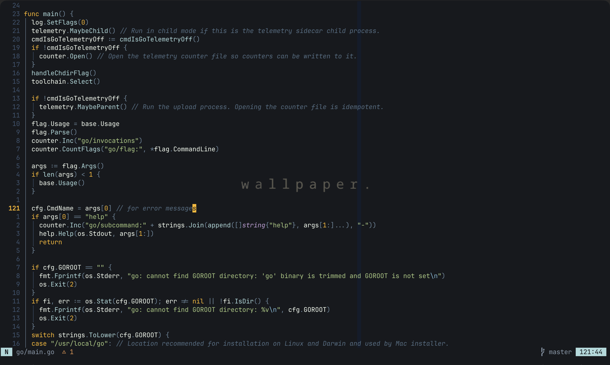
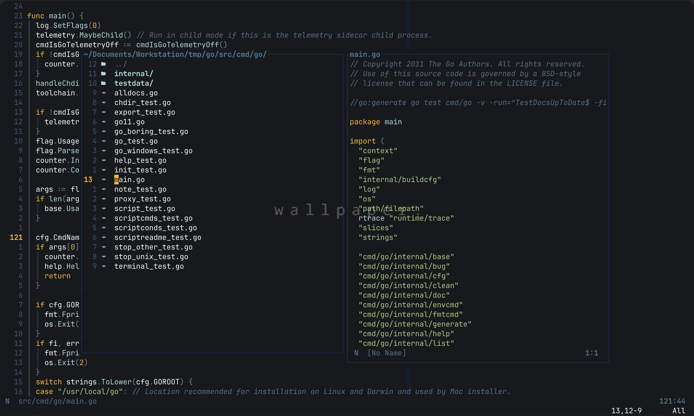
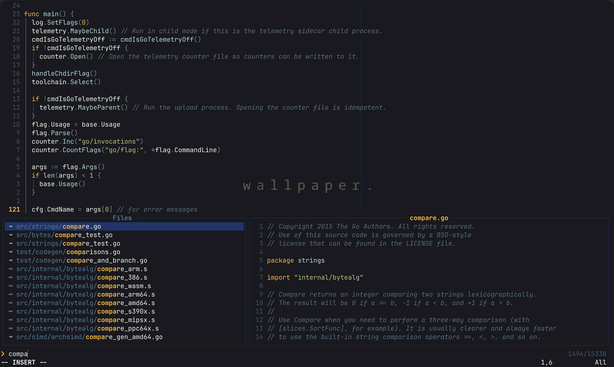

# Oshen.nvim

A dark Neovim colorscheme inspired by deep ocean water at night — five colors drawn from the sea's amber bioluminescence, sea foam, midnight navy, and the shifting blues between shallow and abyss. Designed for transparent terminals and built to stay out of the way while you work.

> Named after _shenfiles_, my personal dotfiles.

<details>
<summary>Code</summary>



</details>

<details>
<summary>Oil</summary>



</details>

<details>
<summary>Snacks picker</summary>



</details>

---

## Palette

The entire scheme is derived from five source colors. Nothing more.

| Role               | Hex       | Preview                                                  |
| ------------------ | --------- | -------------------------------------------------------- |
| Keywords / Numbers | `#ffb703` |  |
| Foreground         | `#f1faee` |  |
| Functions          | `#abdadc` |  |
| Borders / Accents  | `#457b9d` |  |
| Selection / UI     | `#1d3567` |  |

All other colors in the palette are derived from these five, keeping the scheme tight and cohesive.

### Full palette

**Backgrounds**

| Name      | Hex       | Preview                                                  | Usage                             |
| --------- | --------- | -------------------------------------------------------- | --------------------------------- |
| `crust`   | `#060810` |  | Deepest background, extreme fills |
| `mantle`  | `#090c12` |  | Panels, popups, sidebars          |
| `base`    | `#0e1117` |  | Main editor background            |

**Surfaces**

| Name       | Hex       | Preview                                                  | Usage                               |
| ---------- | --------- | -------------------------------------------------------- | ----------------------------------- |
| `surface0` | `#131c2b` |  | Cursorline, word highlights         |
| `surface1` | `#1e2d42` |  | Raised UI (TreesitterContext, etc.) |
| `surface2` | `#2a3f58` |  | Hover states, picker selections     |

**Overlays**

| Name       | Hex       | Preview                                                  | Usage                               |
| ---------- | --------- | -------------------------------------------------------- | ----------------------------------- |
| `overlay0` | `#3d5570` |  | Invisible guides, whitespace chars  |
| `overlay1` | `#526d82` |  | Comments, inactive line numbers     |
| `overlay2` | `#6a8599` |  | Operators, punctuation, conceal     |

**Text tiers**

| Name       | Hex       | Preview                                                  | Usage                               |
| ---------- | --------- | -------------------------------------------------------- | ----------------------------------- |
| `subtext0` | `#8899aa` |  | Secondary info, statusline text     |
| `subtext1` | `#b0c4d8` |  | Brighter secondary, parameters      |
| `text`     | `#f1faee` |  | Main foreground                     |

**Accents**

| Name       | Hex       | Preview                                                  | Usage                               |
| ---------- | --------- | -------------------------------------------------------- | ----------------------------------- |
| `amber`    | `#ffb703` |  | Keywords, numbers, cursor           |
| `peach`    | `#e8944a` |  | Warnings, orange tokens             |
| `green`    | `#a8c97f` |  | Strings, git added                  |
| `sky`      | `#7ab8d4` |  | String escapes, special punctuation |
| `teal`     | `#abdadc` |  | Functions, info diagnostics         |
| `steel`    | `#457b9d` |  | Borders, accents                    |
| `lavender` | `#c3a0d8` |  | Types, hints, constructors          |
| `red`      | `#e05c6e` |  | Errors, git deleted                 |
| `navy`     | `#1d3567` |  | Visual selection, deep UI chrome    |

---

## Features

- **Transparent background** support — your wallpaper shows through everywhere
- **Treesitter** semantic highlight groups
- **LSP** diagnostics and semantic tokens
- **Modular architecture** — groups and integrations are isolated files, easy to extend
- **JetBrainsMono Nerd Font** glyph-aware

### Plugin support

| Plugin                                                                                   |                  |
| ---------------------------------------------------------------------------------------- | ---------------- |
| [gitsigns.nvim](https://github.com/lewis6991/gitsigns.nvim)                              | ✓                |
| [blink.cmp](https://github.com/Saghen/blink.cmp)                                         | ✓                |
| [oil.nvim](https://github.com/stevearc/oil.nvim)                                         | ✓                |
| [snacks.nvim](https://github.com/folke/snacks.nvim)                                      | ✓                |
| [lualine.nvim](https://github.com/nvim-lualine/lualine.nvim)                             | ✓ built-in theme |
| [which-key.nvim](https://github.com/folke/which-key.nvim)                                | ✓                |
| [vim-illuminate](https://github.com/RRethy/vim-illuminate)                               | ✓                |
| [nvim-ufo](https://github.com/kevinhwang91/nvim-ufo)                                     | ✓                |
| [render-markdown.nvim](https://github.com/MeanderingProgrammer/render-markdown.nvim)     | ✓                |
| [todo-comments.nvim](https://github.com/folke/todo-comments.nvim)                        | ✓                |
| [nvim-treesitter-context](https://github.com/nvim-treesitter/nvim-treesitter-context)    | ✓                |
| [nvim-dap](https://github.com/mfussenegger/nvim-dap)                                     | ✓                |
| [harpoon](https://github.com/ThePrimeagen/harpoon)                                       | ✓                |
| [mini.nvim](https://github.com/echasnovski/mini.nvim)                                    | ✓                |
| [tiny-inline-diagnostic.nvim](https://github.com/rachartier/tiny-inline-diagnostic.nvim) | ✓                |

---

## Installation

### lazy.nvim

```lua
{
  "54L1M/Oshen.nvim",
  lazy = false,
  priority = 1000,
  config = function()
    require("oshen").setup({
      transparent = true, -- set false for opaque background
    })
    vim.cmd.colorscheme("Oshen")
  end,
}
```

### rocks.nvim

```toml
[plugins]
"Oshen.nvim" = "scm"
```

---

## Configuration

```lua
require("oshen").setup({
  -- Remove all background colors so your terminal wallpaper shows through.
  -- Pairs well with ghostty's background-opacity setting.
  transparent = false, -- default
})
```

---

## Lualine

A built-in lualine theme is included. The `b` and `c` sections use `NONE`
background so they blend into a transparent terminal.

```lua
require("lualine").setup({
  options = {
    theme = require("oshen.integrations.lualine").get(),
    section_separators = "",
    component_separators = "",
  },
})
```

Mode colors:

| Mode    | Color              |
| ------- | ------------------ |
| NORMAL  | `#abdadc` teal     |
| INSERT  | `#a8c97f` green    |
| VISUAL  | `#c3a0d8` lavender |
| COMMAND | `#ffb703` amber    |
| REPLACE | `#e05c6e` red      |

---

## Plugin structure

```
lua/oshen/
├── init.lua                   public API (setup / load / get_palette)
├── palette.lua                all color definitions
├── highlights.lua             thin orchestrator — loads groups + integrations
├── groups/
│   ├── editor.lua             core editor UI
│   ├── syntax.lua             legacy vim syntax groups
│   ├── treesitter.lua         @capture groups
│   ├── lsp.lua                LSP diagnostics
│   ├── semantic_tokens.lua    @lsp.type.* and @lsp.mod.*
│   └── terminal.lua           vim.g.terminal_color_N
└── integrations/
    ├── lualine.lua
    ├── gitsigns.lua
    ├── illuminate.lua
    ├── blink.lua
    ├── oil.lua
    ├── snacks.lua
    ├── whichkey.lua
    ├── ufo.lua
    ├── render_markdown.lua
    ├── todo_comments.lua
    ├── treesitter_context.lua
    ├── dap.lua
    ├── harpoon.lua
    ├── mini.lua
    └── tiny_inline_diagnostic.lua
```

### Adding a new integration

Create `lua/oshen/integrations/myplugin.lua` following this pattern:

```lua
local M = {}

local function hi(group, opts)
  vim.api.nvim_set_hl(0, group, opts)
end

function M.apply(p, transparent)
  hi("MyPluginNormal", { fg = p.text, bg = transparent and p.none or p.mantle })
end

return M
```

Then add `"oshen.integrations.myplugin"` to the `integrations` list in `highlights.lua`.

---

## Accessing the palette

Other plugins or your own config can read the full color table:

```lua
local p = require("oshen").get_palette()

-- Example: custom indent-blankline colors
vim.api.nvim_set_hl(0, "IblIndent", { fg = p.overlay0 })
vim.api.nvim_set_hl(0, "IblScope",  { fg = p.overlay2 })
```

---

## Ghostty + tmux

A matching [Ghostty](https://ghostty.org) config and tmux palette are
included in [shenfiles](https://github.com/54L1M/shenfiles).

Ghostty settings used with this theme:

```
background-opacity = 0.65
font-family = "JetBrainsMono Nerd Font Mono"
```

---

## Contributing

Issues and PRs are welcome — especially for plugin integrations not listed
above. When adding a new integration, follow the pattern in
`lua/oshen/integrations/` and open a PR with a brief description of the plugin.

---

## License

[MIT](./LICENSE)
